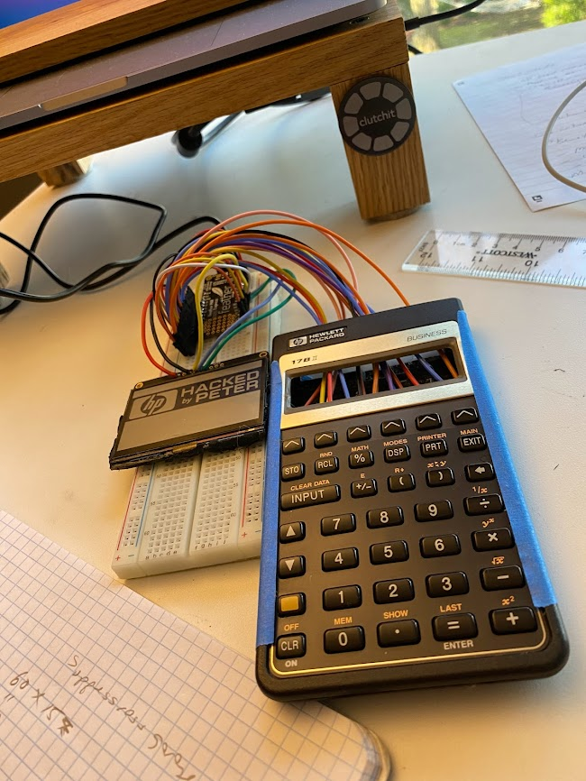

# HP17BII

This is a project done to test several microcontrollers by using them to replace the innards of an HP 17BII business calculator with several new functions, such as Space Invaders game, a piano, and yes of course also hand-coded calculator. 

All attempts are included here.  Probably the most complete version is [HP17B41.ino](HP17B41/HP17B41.ino), though it might take a little work to get any of these to compile at this point.  I only make public because others may wish to replicate some of the functionality below.

`#define PIANO_MODE` renders a piano on the display, then plays notes on the HP's piezo buzzer.  The buzzer is connected to an analog pin, and when a piano key is pressed, the desired frequemcy is tossed into an array (two arrays actually: `toneStart[]` for the start time in millis and `toneFreq[]` for the frequency) to be read and played by the main loop.

`#define GAME_MODE` is the Space Invaders game.  If I come back to this, I'll probably make it a lot more object-oriented.  This version is anything but that.  It relies on a lot of global variables such as `goingLeft`, `goingRight`, `gunX`, `gunY`, `alienX`, `alienY`, and others to figure out where to place the gun and the aliens, whether a bullet has been fired, and the state of the barriers that the gun hides behind.  The hard work is done in a function called `drawPlayArea()` that is called by the main loop.
   
`#define CALC_MODE` is the default mode, the calculator.  It is a bit over-engineered with a really hard to understand function pointer array which is called by main: 

`(*fcns[key][currentMode]) (key);` 

whenever a key press event is detected by the `<Keypad.h>` library.  

Most of this code needs to be rewritten, to be honest.  I only make this project public because there may be useful code snippets for people challenging themselves with similar microcontroller display and sound challenges.

